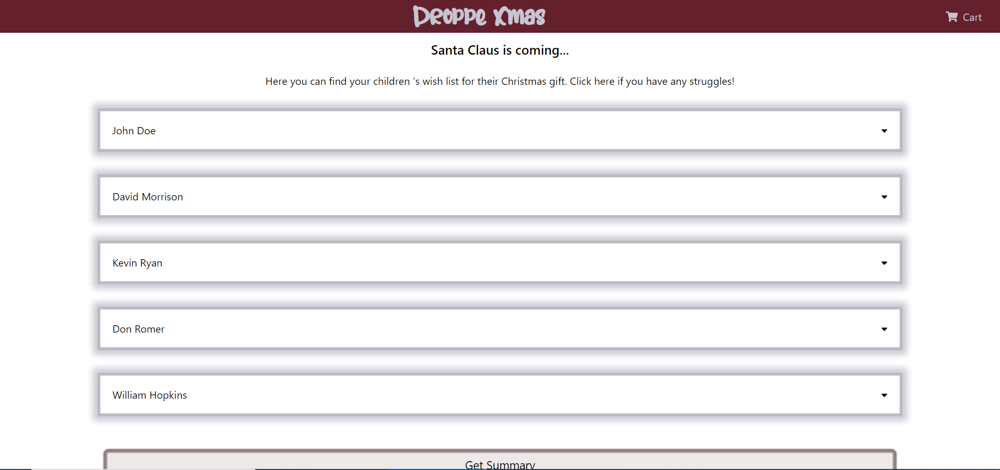

# Droppe Xmas

Pre-asignment for Droppe, hosted on [Heroku](https://www.heroku.com/)

[View live here](https://droppexmas-klez.herokuapp.com/)

## Description

This is the single page web application provides carts get from FakeStoreAPI for users over 50 years old. 

In this platform, user can easily find the wish list of children and decide to whether approve or discard their wishes.


---

## Demo

This app is made with SPA and simple responsive




(Screen shot from desktop UI)


(Screen shot from mobile UI)


---

## Technology

This app is built with Create-react-app and TypeScript with fake API from [FakeStoreAPI](https://fakestoreapi.com/docs)

---

## Development Script

```
npm start
```

Run on local development on port 3000

```
npm run format-all
```

Pretty all dirty code

```
npm run test
```
Run all tests available (currently, only unit test of utils are available)
